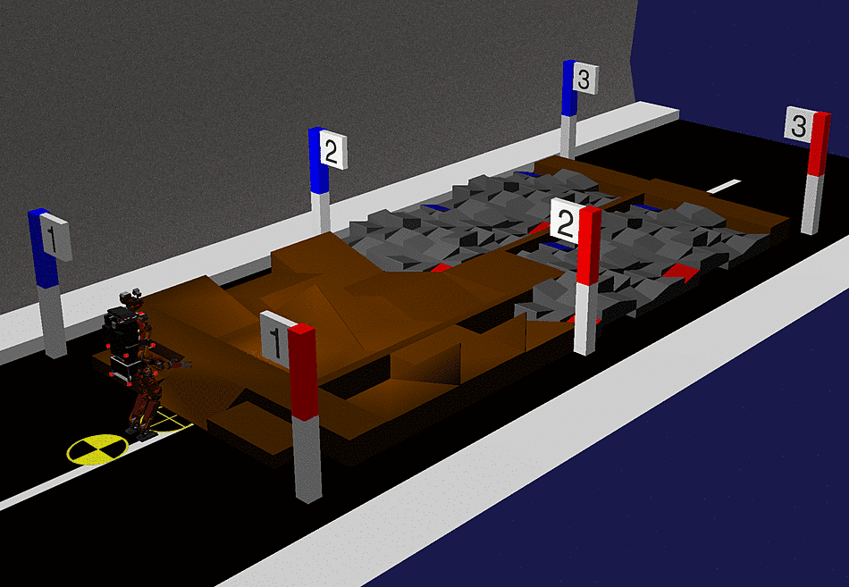
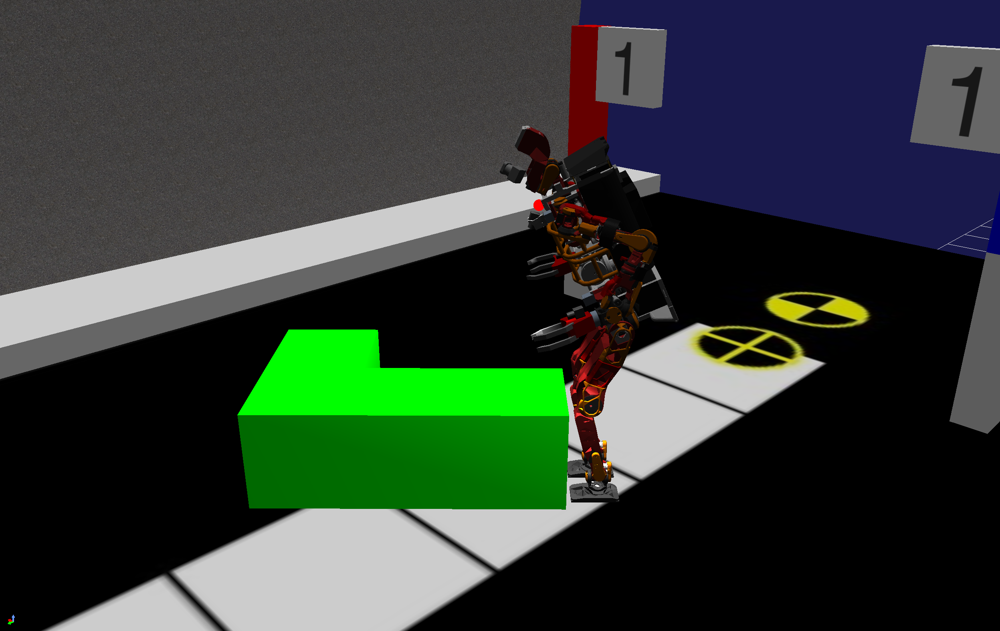

## JVRC2015

#### O1, O2, R1, R2

##### LAUNCH PROGRAMS

- launch fc programs(almost taking over DRC programs)

```bash
rosrun drc_task_common jvrc_fc.sh
```

- launch ocs programs(rviz, furutaractive, controller-device)

```bash
rosrun drc_task_common jvrc_ocs.sh
```

##### EXECUTE TASK

- match transformable marker to cloud
- two choices
-- select the cylinder on plane
-- insert primitive with botton and match it manually

- solve ik
-- change params
--- height of waist[0cm, 15cm lower, 30cm lower]
--- ik mode[grasp, peep1(for hand-cam1), peep2(for hand-cam2)]
-- change robot stand-pos
-- solve-ik with button

- send to robot
-- walk to object
-- send angle to robot
 
#### R2-AB : rubble

- run simulator

```bash
sudo service omniorb4-nameserver restart
pkill -9 choreonoid
choreonoid $(rospack find hrpsys_ros_bridge_jvrc)/config/JVRCR2AB.cnoid --start-simulation
```



###### How to complete this task

Open 4 terminals and execute the following commands.

(1) launch footstep controller and multisense

```bash
rosrun drc_task_common jvrc_fc.sh
```

(2) launch footstep planner and rviz

```bash
rosrun drc_task_common jvrc_ocs.sh
```

(3) launch b-controller

```bash
roslaunch drc_task_common b_control_ui.launch
```

(4) load euslisp

```bash
roseus `rospack find hrpsys_ros_bridge_jvrc`/euslisp/cross-step.l
```

Move JAXON on even ground with the b_controller or on uneven ground with the interactive marker. 
In order to walk across a balance beam, execute ```(start-cross)``` and then ```(cross-step x y th)``` in the 4th terminal. After walking across the balance beam, execute ```(stop-cross)```.

- cross-step mode


#### R2-C : narrow space field

time limit : 5 minutes

- run simulator

```bash
sudo service omniorb4-nameserver restart
pkill -9 choreonoid
choreonoid $(rospack find hrpsys_ros_bridge_jvrc)/config/JVRCR2C.cnoid --start-simulation
```


###### How to complete this task

Open 3 terminals and execute the following commands. JAXON will start moving before rviz is displayed and keep walking until he collides the surrounding walls and stops walking automatically. After that, move JAXON with the interactive marker.

1. close hand as quickly as possible and then generate ``*ri*``

```bash
roseus `rospack find hrpsys_ros_bridge_jvrc`/euslisp/fast-hand-close-and-generate-ri.l
```

2. start walking as quickly as possible with ``hcf``

```python
xsel -b < `rospack find hrpsys_ros_bridge_jvrc`/config/R2C-path.py
ipython -i `rospack find hrpsys_tools`/scripts/hrpsys_tools_config.py -- --use-unstable-rtc --host localhost --port 2809
%paste
```

3. launch rviz and b-controller

```bash
roslaunch hrpsys_ros_bridge_jvrc R2C.launch
```

#### R4 : Secure the Route

Time Limit : 10 minutes

- run simulator

```bash
sudo service omniorb4-nameserver restart
pkill -9 choreonoid
choreonoid $(rospack find hrpsys_ros_bridge_jvrc)/config/JVRCR4.cnoid --start-simulation
```


###### How to complete this task

###### A. Move Large(10kg) L-shaped Obstacles

Open 4 terminals and execute the following commands.

(1) Run rviz ocs

```bash
rosrun drc_task_common jvrc_ocs.sh
```

(2) Run rviz fc

```bash
rosrun drc_task_common jvrc_fc.sh
```

(3) Launch b-controller

```bash
roslaunch drc_task_common b_control_ui.launch
```

(4) Generate ``*ri*`` and load walking mode functions

```bash
roseus `rospack find hrpsys_ros_bridge_jvrc`/euslisp/walking_config.l
```

In 4th terminal, then execute (speedup-mode) command in case of moving to the front of large obstacles quickly, and execute (kick-mode) command in case of kick-pushing the large obstacles.

- (speedup-mode)


- (kick-mode)



After changing mode, move JAXON with the interactive marker and execute go-pos command.

###### B. Remove Thin(3kg) L-shaped Obstacles
